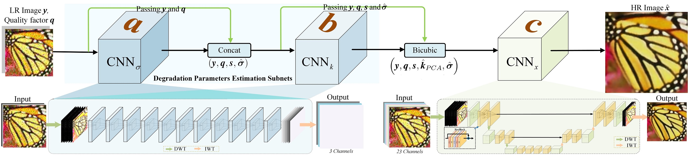

# CBSR
Learning Cascaded Convolutional Networks for Blind Single Image Super-Resolution
# Abstract
Thispaperstudiestheblindsuper-resolutionofreallow-qualityandlow-resolution (LR) images. Existing convolutional network (CNN) based approaches usually learn a single image super-resolution (SISR) model for a specific downsampler (e.g., bicubic downsampling, blurring followed by downsampling). The learned model, however, is tailored to the specific downsampler and fails to super-resolve
real LR images which are degraded in more sophisticated and diverse manners. Moreover, the ground-truth high-resolution (HR) of real LR images are generally unavailable. Instead of learning from unpaired real LR-HR images or a specific downsampler, this paper learns blind SR network from a realistic, parametric degradation model by considering blurring, noise, downsampling, and even JPEG compression. In contrast to direct blind reconstruction of HR image, the proposed model adopts a cascaded architecture for noise estimation, blurring estimation,
and non-blind SR, which can be jointly end-to-end learned from training data and benefit generalization ability. By taking the bicubicly upscaled LR image as input to non-blind SR, the proposed method can present a single unified model for blind SR with any upscaling factors and varying degradation parameters. Experimental results show that the proposed method performs favorably on synthetic and real LR images.

## Dependencies
* Python 3.5
* PyTorch >= 1.2.0
* numpy
* skimage
* imageio
* matplotlib
* tqdm
* h5py
* scipy 1.0.0

## Network Architecture
The architecture of CBSR, which is comprised of three parts: 
  %
  $\textbf{\textit{a}}$) noise estimation subnet CNN$_\sigma$ takes LR image $\textbf{\textit{y}}$ with size $m\times n \times 3$ and JPEG quality factor $\textbf{\textit{q}}$ with size $m\times n \times 1$ as input and predicts the $m\times n \times 3$ noise level map $\hat{ \boldsymbol{\sigma}}$; 
  %
  $\textbf{\textit{b}}$)  blur kernel estimation subnet CNN$_{\textbf{\textit{k}}}$ takes $\textbf{\textit{y}}$, $\textbf{\textit{q}}$, $\textbf{\textit{s}}$ and $\hat{ \boldsymbol{\sigma}}$ as input and predicts the $m\times n \times 3$ covariance matrix $\hat{ \boldsymbol{\Sigma} }$ of blur kernel, which is then transformed to the $m\times n \times 15$ $\hat{ \textbf{\textit{k}}}_{PCA}$ matrix;  
  % 
  $\textbf{\textit{c}}$)  non-blind SISR subnet CNN$_\textbf{\textit{x}}$ takes the bicubic interpolations of $\textbf{\textit{y}}$, $\textbf{\textit{q}}$, $\textbf{\textit{s}}$, $\hat{ \boldsymbol{\sigma}}$ and $\hat{ \textbf{\textit{k}}}_{PCA}$ with size $s \cdot m \times s \cdot n \times 23$ as input and predicts the final SR image $\hat{ \textbf{\textit{x}}}$ with size $s \cdot m \times s \cdot n \times 3$.
<p align="center">
    
    <br />    <small>  </small>
</p>


## Train
Data Set: [DIV2K 800 training images](https://data.vision.ee.ethz.ch/cvl/DIV2K/).

## Test
* Pretraining model can be found [here]().
* Test commond

 * For image denoising
```python
python main.py --model CBSR --save CBSR --scale 2  --save_results --print_model --n_colors 1 --test_only --self_ensemble --resume -1 --pre_train pretrain_model/ --data_test Set5
```

## Contact
Please send email to lpj008@126.com

## Acknowledgements
This code is built on [EDSR (PyTorch)](https://github.com/thstkdgus35/EDSR-PyTorch). We thank the authors for sharing their codes of [EDSR Torch  version](https://github.com/LimBee/NTIRE2017) and [PyTorch version](https://github.com/thstkdgus35/EDSR-PyTorch).

