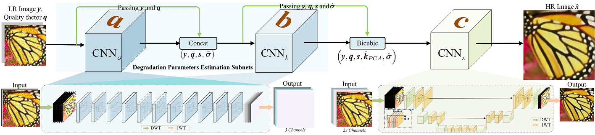

# CBSR
Learning Cascaded Convolutional Networks for Blind Single Image Super-Resolution
# Abstract
Thispaperstudiestheblindsuper-resolutionofreallow-qualityandlow-resolution (LR) images. Existing convolutional network (CNN) based approaches usually learn a single image super-resolution (SISR) model for a specific downsampler (e.g., bicubic downsampling, blurring followed by downsampling). The learned model, however, is tailored to the specific downsampler and fails to super-resolve real LR images which are degraded in more sophisticated and diverse manners. Moreover, the ground-truth high-resolution (HR) of real LR images are generally unavailable. Instead of learning from unpaired real LR-HR images or a specific downsampler, this paper learns blind SR network from a realistic, parametric degradation model by considering blurring, noise, downsampling, and even JPEG compression. In contrast to direct blind reconstruction of HR image, the proposed model adopts a cascaded architecture for noise estimation, blurring estimation, and non-blind SR, which can be jointly end-to-end learned from training data and benefit generalization ability. By taking the bicubicly upscaled LR image as input to non-blind SR, the proposed method can present a single unified model for blind SR with any upscaling factors and varying degradation parameters. Experimental results show that the proposed method performs favorably on synthetic and real LR images.

## Dependencies
* Python 3.5
* PyTorch >= 1.2.0
* numpy
* skimage
* imageio
* matplotlib
* tqdm
* h5py
* scipy 1.0.0

## Network Architecture
<p align="center">
    
    <br />    <small>  </small>
</p>


## Train
Data Set: [DIV2K 800 training images](https://data.vision.ee.ethz.ch/cvl/DIV2K/).

## Test
* Pretraining model can be found [here]().
* Test commond
```python
--model CBSR --save CBSR --scale 4 --n_feats 64 --save_results --print_model --n_GPUs 1 --testpath your_testset_path --ext_tt .png --n_resblocks 2 --resume -1 --pre_train your_model_path --test_only
```
## Key Function
model.common.cov2pca  -----  convert covariance matrix to kernels and reducing by PCA
data.common.im_process  -----   image degradation processing

## Contact
Please send email to lpj008@126.com

## Acknowledgements
This code is built on [EDSR (PyTorch)](https://github.com/thstkdgus35/EDSR-PyTorch). We thank the authors for sharing their codes of [EDSR Torch  version](https://github.com/LimBee/NTIRE2017) and [PyTorch version](https://github.com/thstkdgus35/EDSR-PyTorch).

